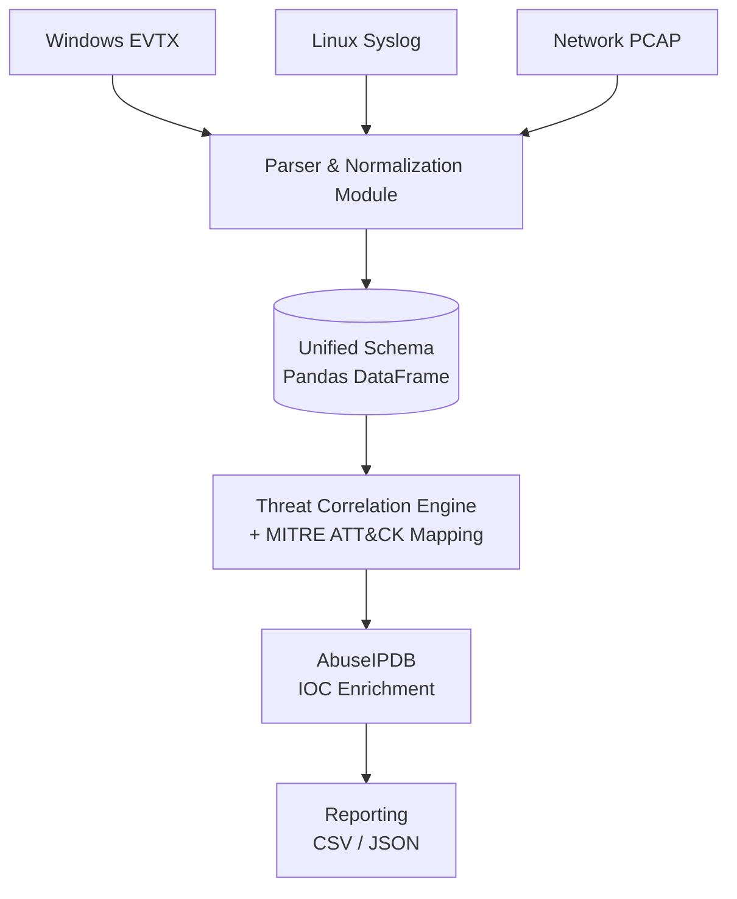

<div align="center">

# 🛡️ SOC Log Analysis & Threat Intelligence Engine

**A multi-source log correlation engine that ingests Windows EVTX, Linux Syslog, and Network PCAP data, maps detections to MITRE ATT&CK, and enriches suspicious IPs via AbuseIPDB.**


</div>

---

## Table of Contents

- [Overview](#overview)
- [Key Features](#key-features)
- [Architecture](#architecture)
- [Project Structure](#project-structure)
- [Installation](#installation)
- [Configuration](#configuration)
- [Usage](#usage)
- [Sample Output](#sample-output)
- [MITRE ATT&CK Mapping](#mitre-attck-mapping)
- [Severity Scoring Logic](#severity-scoring-logic)
- [Testing](#testing)
- [Roadmap](#roadmap)
- [Disclaimer](#disclaimer)
- [License](#license)

---

## Overview

SOC Analyzer is a Python-based log correlation pipeline built for security analysts who need to triage evidence from multiple sources without switching between four different tools. It normalizes heterogeneous log formats into a single schema, flags IPs that cross a suspicious-activity threshold, correlates host-based and network-based indicators for the same IP, and maps every detection to its corresponding MITRE ATT&CK technique — then enriches the result with live threat intelligence from AbuseIPDB.

It was built to answer one question quickly: **"Which of these IPs actually matter, and why?"**

---

## Key Features

| Feature | Description |
|---|---|
| 🗂️ **Multi-Source Ingestion** | Parses Windows EVTX, Linux SSH auth logs, and raw PCAP traffic into one unified format. |
| 🧬 **Unified Event Schema** | Normalizes every source into `EventID`, `Timestamp`, `User Name`, `Workstation`, `IP`. |
| 🔗 **Cross-Source Correlation** | Detects when the *same* IP appears in both host logs (e.g. brute force) and network logs (e.g. port scan) and escalates severity automatically. |
| 🎯 **MITRE ATT&CK Mapping** | Every detection is tagged with its Technique ID and name (e.g. `T1110 – Brute Force`). |
| 🌐 **IOC Enrichment** | Live AbuseIPDB lookups for confidence score, country, and ISP on flagged IPs. |
| ⚙️ **Extensible Config** | Detection thresholds and MITRE mappings live in YAML — no code changes needed to tune the engine. |
| 🧪 **Unit Tested** | Core correlation logic is covered by an automated test suite. |

---

## Architecture



Each parser is responsible only for translating its source format into the unified schema — all correlation, scoring, and mapping logic lives in one place (`core/correlator.py`), so adding a new log source doesn't touch the detection logic at all.

---

## Project Structure

```
soc-analyzer/
├── core/
│   ├── cleaner.py          # Normalizes & sorts raw logs into a clean DataFrame
│   └── correlator.py       # Threat scoring, cross-source detection, MITRE mapping
├── enrichment/
│   └── ioc_lookup.py       # AbuseIPDB API integration
├── parsers/
│   ├── evtx_parser.py      # Windows Event Log (.evtx) parser
│   ├── pcap_parser.py      # Network traffic (.pcap) parser + port-scan detection
│   └── syslog_parser.py    # Linux SSH auth log parser
├── reporters/
│   └── exporter.py         # CSV / JSON report generation + terminal summary
├── tests/
│   └── test_correlator.py  # Unit tests for the correlation engine
├── config.yaml             # Thresholds & MITRE ATT&CK mapping definitions
├── main.py                 # CLI entry point
├── requirements.txt
├── .env.example            # Template for required environment variables
├── .gitignore
└── README.md
```

---

## Installation

### Prerequisites
- Python 3.9+
- PCAP reading support (`libpcap` on Linux/macOS, or [Npcap](https://npcap.com/) on Windows)

### Setup

```bash
git clone https://github.com/your-username/soc-analyzer.git
cd soc-analyzer

# Create and activate a virtual environment (recommended)
python -m venv venv
source venv/bin/activate      # Windows: venv\Scripts\activate

# Install dependencies
pip install -r requirements.txt

# Set up environment variables
cp .env.example .env
# then edit .env and add your AbuseIPDB API key
```

---

## Configuration

All detection thresholds and MITRE mappings are defined in `config.yaml`:

```yaml
thresholds:
  failed_logins: 5          # Events from one IP before it's flagged
  port_scan_packets: 100    # Distinct ports contacted before flagging PORT_SCAN

ioc_enrichment:
  enabled: true             # Set false to skip AbuseIPDB lookups entirely
```

**API keys are never stored in `config.yaml`.** Set your AbuseIPDB key as an environment variable:

```bash
# .env
ABUSEIPDB_API_KEY=your_key_here
```

Need to track additional event IDs or techniques? Pass a second mapping file at runtime with `--extra-config` instead of editing the base config — see [Usage](#usage) below.

---

## Usage

```bash
# Single source
python main.py --syslog samples/auth.log

# Combine multiple sources in one run
python main.py --evtx samples/Security.evtx --pcap samples/traffic.pcap --syslog samples/auth.log

# Override the alert threshold for this run only
python main.py --syslog samples/auth.log --threshold 3

# Merge in an extra MITRE mapping file
python main.py --syslog samples/auth.log --extra-config custom_mappings.yaml

# Write reports to a custom directory
python main.py --syslog samples/auth.log --output reports/2026-08-26
```

| Flag | Description | Default |
|---|---|---|
| `--evtx` | Path to a Windows EVTX file | — |
| `--pcap` | Path to a PCAP capture | — |
| `--syslog` | Path to a Linux syslog file | — |
| `--config` | Path to the base config YAML | `config.yaml` |
| `--extra-config` | Path to an additional MITRE mapping YAML | — |
| `--threshold` | Override the failed-event threshold | value from config |
| `--output` | Output directory for reports | `output` |

---

## Sample Output

Running the engine produces `details.csv` (every normalized event) and `summary.json` (flagged IPs only):

```json
[
  {
    "IP": "10.0.0.99",
    "Total_Events": 6,
    "Severity": "CRITICAL",
    "Cross_Source_Detected": true,
    "Events": ["SSH_FAILED_LOGIN", "PORT_SCAN"],
    "MITRE_Techniques": ["T1046 - Network Service Discovery", "T1110 - Brute Force"],
    "First_Seen": "2026-08-01T10:00:00",
    "Last_Seen": "2026-08-01T10:05:00",
    "Duration_Seconds": 300.0
  }
]
```

Plus a readable terminal summary for quick triage during an investigation.

---

## MITRE ATT&CK Mapping

| Trigger | Technique ID | Technique Name | Default Severity |
|---|---|---|---|
| `4625` | T1110 | Brute Force | MEDIUM |
| `SSH_FAILED_LOGIN` | T1110 | Brute Force | MEDIUM |
| `4624` | T1078 | Valid Accounts | INFO |
| `4672` | T1078.002 | Domain Accounts | LOW |
| `PORT_SCAN` | T1046 | Network Service Discovery | HIGH |
| `DNS_QUERY` | T1071 | Application Layer Protocol | LOW |

Add your own via `config.yaml` or an `--extra-config` overlay file — no code changes required.

---

## Severity Scoring Logic

| Condition | Severity |
|---|---|
| Event count ≥ 20, **or** host + network indicators found for the same IP | 🔴 **CRITICAL** |
| Event count ≥ 10 | 🟠 **HIGH** |
| Event count ≥ configured threshold (default: 5) | 🟡 **MEDIUM** |
| Below threshold | Not flagged |

Cross-source detection is what elevates a "just a lot of failed logins" IP to CRITICAL — it means the same source is showing up in *both* your host logs and your network logs, which is a much stronger signal than volume alone.

---

## Testing

```bash
python -m unittest discover tests
```

The current suite covers the correlation engine's core branches: empty-input handling, standard threshold-based severity, and cross-source CRITICAL escalation.

---

## Roadmap

- [ ] IPv6 support in the syslog parser
- [ ] Additional enrichment sources (VirusTotal, GreyNoise)
- [ ] HTML/PDF report export
- [ ] Configurable severity weighting per event type

---

## Disclaimer

This tool is intended for educational use and authorized security testing/log analysis on systems and data you own or have explicit permission to analyze. It is not a substitute for a production SIEM.

---

## License

Distributed under the [MIT License](LICENSE).
